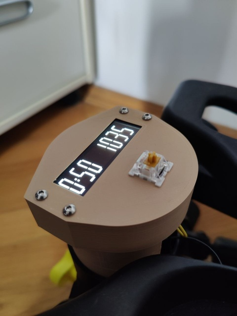

# Habits Stepper


## Why
Automatically tracks stepping sessions without requiring any button presses to start or reset workouts. Time is synced via NTP so new day and week boundaries are handled automatically — no need to remember to reset counts on Monday. Just start stepping and sessions are tracked correctly.

## Overview
* auto-track stepping sessions for the last 2 weeks, time-synced via NTP with a compile-time IANA timezone
* async embassy runtime; display updates only on input events via channels
* deep sleep after 90s of inactivity; 18650 battery + TP4057 charger gives ~1 month uptime
* firmware upload (probe-rs), defmt logs (RTT), and battery charging over a single USB-C port
* ring buffer in NOR flash (512 sessions); data survives deep sleep and reboots
* on-MCU tests via embedded_test
* 3D-printed case (OpenSCAD) with SH1122 256x64 OLED display

## Build & Flash
```
nix develop

cargo run --release
    Finished `release` profile [optimized + debuginfo] target(s) in 0.10s
     Running `probe-rs run --chip=esp32c3 --preverify --always-print-stacktrace --no-location target/riscv32imc-unknown-none-elf/release/habits-stepper`
    Verifying ✔ 100% [####################] 360.25 KiB @  74.20 KiB/s (took 5s)           Finished in 5.09s
03:00:00 [INFO ] init: embassy initialized
03:00:00 [INFO ] storage: flash capacity: 4194304B
03:00:00 [INFO ] storage: loaded 18 sessions from flash (head=18)
13:57:03 [INFO ] time: rtc seeded: Europe/Moscow 2026-06-13 13:57:03
13:57:03 [INFO ] wifi: connecting to "fellowship-of-the-ring-2"
13:57:04 [INFO ] wifi: connected to "fellowship-of-the-ring-2"
13:57:18 [INFO ] time: synced (+4s)
13:57:18 [INFO ] time: Europe/Moscow 2026-06-13 13:57:18
13:57:18 [INFO ] time: waiting 90s for inactivity
13:57:26 [INFO ] input: reed closed
13:57:26 [INFO ] time: activity before timeout, resetting
13:57:26 [INFO ] time: waiting 90s for inactivity
13:57:26 [INFO ] display: session update: today=50min(1036steps) week=50min
13:57:29 [INFO ] input: reed closed
13:57:29 [INFO ] time: activity before timeout, resetting
13:57:29 [INFO ] time: waiting 90s for inactivity
13:57:29 [INFO ] display: session update: today=50min(1037steps) week=50min
```
